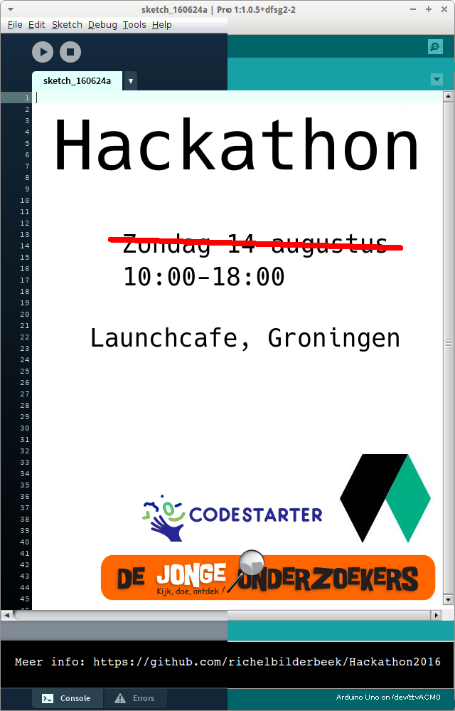

# Hackathon2016

Hackathon organized by DJO and Fablab in the summer holiday of 2016

 * Wat: Hackathon voor leerlingen van 8-18 jaar
 * Wanneer: zondag 14 augustus 2016 10:00-18:00
 * Waar: het *hele* Launchcafe, binnen via de zijdeur aan de Herebinnensingel 2
 * Kosten: afhankelijk van sponsoring, anders kostprijs van eten en drinken

## Planning 

Begintijd|Activiteit deelnemers|Activiteit begeleiders
---|---|---
9:00| - |gebouw open, opbouwen
9:45|deur open, ontvangst goodiebag|gastheer/vrouw aanwezig, koffie, uitreiken goodiebag
10:15|opening|bekendmaking thema/doel, vorm, etc
10:30|vorming groepen|groepsvorming begeleiden
11:00|bekendmaking groepen, start hackathon|noteren groepen, begeleiden hackathon
15:00| - | presentatieruime klaarmaken
16:00| - | technische doorloop met groepen?
17:00|presentaties (5 minuten per groep)| - 
17:45|?prijsuitreiking, afsluiting|?prijsuitreiking, afsluiting
18:00|einde hackathon|opruimen
18:30| - | deur dicht, evaluatie in kroeg
19:30| - | eind formele gedeelte

## Veelgestelde vragen

## Waar is het?

In het Lauchcafe aan de Herestraat 106 te Groningen.
Wij gaan echter via de zijdeur naar binnen, aan de Herebinnensingel 2.

[PLATTEGROND HIERO]

## Ik ben een DJO leerling. Ben ik welkom?

Ja. Richel geeft je een flyer.

## Ik ben een minderjarige, maar geen DJO leerling. Ben ik welkom?

Jawel. De persoon die jou op de hoogte heeft gebracht, zal
een flyer voor je verzorgen :-)

## Ik ben een volwassene. Ben ik welkom?

Formeel enkel in de rol van vrijwilliger.
Het is denkbaar dat de vrijwilligers ook samen iets in 
elkaar gaan knutselen. Het werk van de volwassenen zal niet
formeel gepresenteerd en beoordeeld worden.

## Werk je alleen of in een team?

Je werkt in teams van minimaal twee en maximaal vijf personen.

Tip: vorm een team van minstens een iemand van de donderdag (die 
kunnen goed programmeren) en iemand van de vrijdag (die 
zijn goed met electronica).

## Ik ken niemand. Is dat een probleem?

Nee hoor, er is tijd om teams te vormen.

## Hoe zit het met eten en drinken?

 * Eten: er wordt een goodiebag uitgedeeld met redelijk gezond voedsel
 * Drinken: koffie, thee en ranja zijn ongelimiteerd 

## Waar kan ik de flyer downloaden?

## Waar kan ik het programmaboekje downloaden?

 * [Hier (pdf)](Boekje.pdf) [TODO]

## Is er internet?

Ja, er is draadloos internet in het gehele pand:

 * SSID: `LaunchCafe`
 * ww: krijg je bij binnenkomst
