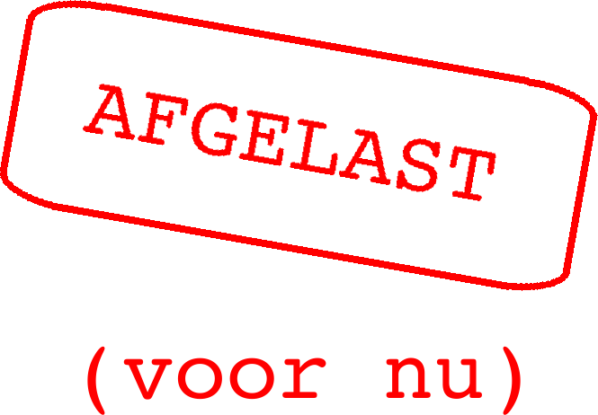

# Hackathon2016

Hackathon georganiseerd de DJO en Fablab in de zomervakantie van 2016.
Deze is afgelast en er wordt een nieuwe datum gekozen.

Geef je op door een mailtje te sturen naar [Richel zijn emailadres](http://www.richelbilderbeek.nl/Email.png).

Deze GitHub is een werk in uitvoering.

 * Wat: Hackathon voor leerlingen van 8-18 jaar
 * Wanneer: zondag 14 augustus 2016 10:00-18:00
 * Waar: het *hele* Launchcafe, binnen via de zijdeur aan de Herebinnensingel 2
 * Kosten: afhankelijk van sponsoring, anders kostprijs van eten en drinken

## Planning 

Huidig idee:

Begintijd|Activiteit deelnemers|Activiteit begeleiders
---|---|---
9:00| - |gebouw open, opbouwen
9:45|deur open, ontvangst goodiebag|gastheer/vrouw aanwezig, koffie, uitreiken goodiebag
10:15|opening|opening in VentureWorks collegezaal
10:30|vorming groepen|groepsvorming begeleiden
11:00|vastlegging groepen, start hackathon|noteren groepen, begeleiden hackathon
15:00| - | presentatieruime klaarmaken
16:00| - | technische doorloop met groepen?
17:00|presentaties (5 minuten per groep)| - 
17:45|?prijsuitreiking, afsluiting|?prijsuitreiking, afsluiting
18:00|einde hackathon|opruimen
18:30| - | deur dicht, evaluatie
19:30| - | eind formele gedeelte

## Veelgestelde vragen

## Waar is het?

In het Lauchcafe aan de Herestraat 106 te Groningen.
Wij gaan echter via de zijdeur naar binnen, aan de Herebinnensingel 2.

Hier binnen Groningen:

Hier wat meer ingezoomd:

## Wat zijn de kosten?

Dit is nog onbekend, maar wel een van deze opties:

 * Nul euro: indien een sponsor de kosten op zich neemt
 * Tien euro: kostprijs van het eten en drinken

## Ik ben een DJO leerling. Ben ik welkom?

Ja. Richel geeft je een flyer.

## Ik ben een minderjarige, maar geen DJO leerling. Ben ik welkom?

Jawel. De persoon die jou op de hoogte heeft gebracht, zal
een flyer voor je verzorgen :-)

## Ik ben een volwassene. Ben ik welkom?

Formeel enkel in de rol van vrijwilliger.
Het is denkbaar dat de vrijwilligers ook samen iets in 
elkaar gaan knutselen. Het werk van de volwassenen zal niet
formeel gepresenteerd en beoordeeld worden.

## Werk je alleen of in een team?

Je werkt in teams van precies vier personen.

Elk team bestaat uit precies vier personen:

 * minstens 1x coach/teamcaptain: dit kan prima een meerderjarige zijn
 * minstens 1x iemand die Arduino kan
 * minstens 1x iemand die Processing kan

Dit zijn drie verschillende personen.

Je kunt je nu al opgeven op de GitHub, by 'Issues'.

## Ik ken niemand. Is dat een probleem?

Nee hoor, er is tijd om teams te vormen.

## Wat zijn de teams?

Er zijn nu vier teams. Je kunt je
opgeven bij Richel, je teachcoach/teamcaptain
of via de Issues van deze GitHubs

### Team Carmen

 * Coach: Carmen IJsebaart
 * Arduino expert:
 * Processing expert:
 * Vrije keuze:

### Team Jan

 * Coach: Jan Kotlarski
 * Arduino expert:
 * Processing expert:
 * Vrije keuze:

### Team Noemie

 * Coach: Noemie van Sinderen
 * Arduino expert: Amaia
 * Processing exert: Redmar
 * Vrije keuze:

### Team Thijs

 * Coach: Thijs van Beers
 * Arduino expert:
 * Processing expert:
 * Vrije keuze:

## Wie zijn er nog meer?

 * Richel Bilderbeek: Organisatie, BHV, maar kan ook Arduino en Processing
 * Winand Slingenbergh: Organisatie, maar kan ook 3D printen en lasersnijden
 * Kerensa Strijker: Organisatie, maar kan ook 3D printen en lasersnijden
 * ?Mervin Koops: Organisatie, maar kan ook 3D printen en lasersnijden
 * ?Terrence: Organisatie, maar kan ook 3D printen en lasersnijden

## Wat is de opdracht?

Er zijn meerdere opdrachten:

 * Bedenk een oplossing om stroomverbruik te meten en te visualiseren
 * Bedenk een oplossing om het klimaat van een ruimte te meten en visualiseren
 * Bedenk een oplossing zodat er alleen parfum gesproeid wordt bij het toilet als het stinkt, en niet elke keer als de deur open gaat
 * Bedenk een manier om de gordijnen automatisch open en dicht te laten gaan aan de hand van he donker het is en een manier om te visualiseren waneer dit gebeurd
 * Bedenk een manier om te zien of de flex plekken bezet zijn en te visualiseren hoe vaak mensen koffie gaan halen en hoe vaak het druk is
 * Bedenk een oplossing om te weten wanneer de planten water nodig hebben en hoe je dit visualiseert

Je mag zelf een of meer opdrachten kiezen om te doen.

## Wie is de jury?

 * Een persoon van infotopics
 * Een persoon van het Launchcafe
 * Nog iemand ([Issue 7](https://github.com/richelbilderbeek/Hackathon2016/issues/7))

## Wat is de prijs?

Als je wint, zou het kunnen dat je je systeem ook echt mag gaan bouwen.
Het Launchcafe betaalt dan alles wat je nodig hebt.
En misschien halen we er ook de krant bij :-)

## Hoe zit het met eten en drinken?

 * Eten: er wordt een goodiebag uitgedeeld met redelijk gezond voedsel
 * Drinken: koffie, thee en ranja zijn ongelimiteerd 

## Waar kan ik het programmaboekje downloaden?

 * (Ooit kan dat) [hier (pdf)](Boekje.pdf) [TODO]

## Is er internet?

Ja, er is draadloos internet in het gehele pand:

 * SSID: `LaunchCafe`
 * Wachtwoord krijg je bij binnenkomst

## Is er een BHV
